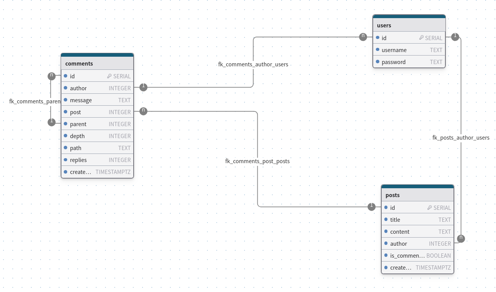
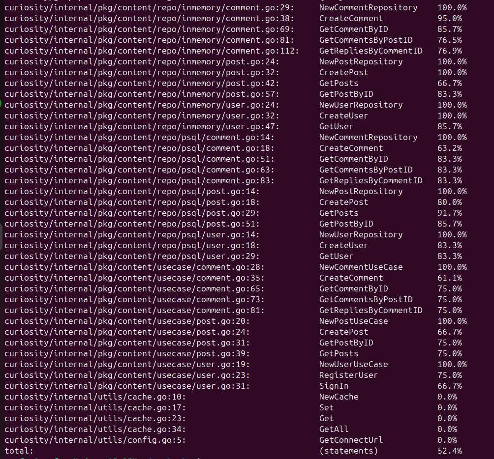

# Curiosity

# Содержание:
- ## [Имеющиеся ручки](#имеющиеся-ручки)
- ## [База данных и Схемы](#база-данных-и-схемы)
- ## [Про реализацию In-memory](#реализация-in-memory)
- ## [Про тесты и coverage](#тесты-и-покрытие)
- ## [Запуск сервиса. Выбор режима данных](#запуск-сервиса)


## ИМЕЮЩИЕСЯ РУЧКИ
### Query:
* posts: [Post!]! - позволяет получить список всех постов
* postComments(postID: Int!, limit: Int!, offset: Int!): [Comment!]! - позволяет получить список корневых комментариев 
(которые не являются ответами на что-то) поста по ID поста, limit и offset - настройки пагинации
* replyComments(rootID: Int!): [Comment!]! - позволяет получить список ответов на комментарий по ID комментария


### Mutation:
* createPost(input: NewPost!): Post - позволяет создать пост
* createComment(input: NewComment!): Comment! - позволяет создать комментарий к посту
* signUp(input: NewUser!): Int! - позволяет зарегистрироваться (регистрация максимально упрощена) (возвращает ID пользователя)
* signIn(input: NewUser!): Int! - позволяет авторизоваться (авторизация максимально упрощена) (возвращает ID пользователя)

## БАЗА ДАННЫХ И СХЕМЫ



Добавлены индексы в таблице posts на поля:
1. ID
2. author
3. created_at

Добавлены индексы в таблице comments на поля:
1. ID
2. author
3. post
4. created_at

Добавлены индексы в таблице users на поля:
1. ID
2. Username


## Реализация In-memory
В каждом репозитории используется структура Кэш
```go
type Cache[K comparable, V any] struct {
items map[K]V
mu    *sync.RWMutex
}
```

с методами:
* Set(key K, value V) - добавляет значение в мапу items 
* Get(key K) (V, bool) - возвращает значение из мапы по ключу key
* GetAll() []V - возвращает массив всех значений из мапы

Данные храним в мапах. В случае с комментариями и постами ключем является ID (int), а значением models.Comment и models.Post соответственно.

В случае с пользователями - ключем является username (string), а значение - models.User

```go
type CommentCache interface {
Get(key int) (models.Comment, bool)
Set(key int, value models.Comment)
GetAll() []models.Comment
}
```

```go
type PostCache interface {
Get(key int) (models.Post, bool)
Set(key int, value models.Post)
GetAll() []models.Post
}
```

```go
type UserCache interface {
	Get(key string) (models.User, bool)
	Set(key string, value models.User)
	GetAll() []models.User
}
```

Структуры репозиториев

```go
type CommentRepository struct {
	mu      *sync.RWMutex
	cache   CommentCache
	counter int
}
```

```go
type PostRepository struct {
	cache   PostCache
	mu      *sync.RWMutex
	counter int
}
```

```go
type UserRepository struct {
	cache   UserCache
	mu      *sync.RWMutex
	counter int
}
```

## Тесты и покрытие

Проверить покрытие можно следующей командой:
```bash
go test -json ./... -coverprofile coverprofile_.tmp -coverpkg=./... ;  cat coverprofile_.tmp | grep -Ev 'generated.go|interfaces.go|docs.go|main.go|\_generated\.go|mock' > coverprofile.tmp ;  rm coverprofile_.tmp ;  go tool cover -html coverprofile.tmp ;  go tool cover -func coverprofile.tmp
```



Тестами покрыт Usecase, In-memory repo и Psql repo

## Запуск сервиса
Сервис и база данных к нему запускаются с помощью команды:
```bash
STORAGE_TYPE=memory make curiosity-run
```
Эта команда запускает сборку сервиса и запускает docker-compose. Флаг STORAGE_TYPE отвечает за режим хранения данных:
1. Значение PSQL - сервис будет сохранять данные в БД (значение по умолчанию) 
2. Значение memory - сервис будет сохранять данные in-memory

Команда для остановки и удаления контейнеров:
```bash
make curiosity-down
```